# 🚀 NovaConnect - Kurumsal İletişim & Mail Yönetim Sistemi

NovaConnect, kurumsal şirketlerin iç iletişimini daha güvenli, yönetilebilir ve modern bir arayüzle sağlaması amacıyla geliştirilmiş kapsamlı bir **SaaS (Software as a Service)** projesidir. 

Sadece bir mesajlaşma aracı olmanın ötesinde; rol tabanlı yetkilendirme, şikayet (denetim) yönetimi ve dinamik filtreleme özellikleriyle tam donanımlı bir iletişim paneli sunar. Projenin arayüzü, kullanıcı deneyimini (UX) en üst düzeye çıkarmak için modern **Glassmorphism** tasarım dili ve ferah pastel tonlar kullanılarak **Tailwind CSS** ile sıfırdan tasarlanmıştır.

<br/>

## ✨ Öne Çıkan Özellikler

- **📧 Gelişmiş Mail Yönetimi:** Gelen kutusu, gönderilenler, taslaklar, çöp kutusu ve önemli mesajlar modülleri ile uçtan uca mesaj yönetimi.
- **🔍 Dinamik Filtreleme Sistemi:** Mesajları tarihe, okundu/okunmadı durumuna, kategorilere (İş, Kişisel, Sosyal) ve anahtar kelimelere göre anında filtreleme.
- **🛡️ 3 Uyarı (Strike) & Otomatik Ban Sistemi:** Sistem içerisinde kuralları ihlal eden veya şikayet edilen kullanıcıların yöneticiler tarafından uyarılması ve 3 uyarı alan kullanıcının sisteme erişiminin (Login) otomatik olarak engellenmesi.
- **👥 Rol Tabanlı Yetkilendirme (RBAC):** Admin ve Standart Kullanıcı (User) rolleri ile yetki sınırlandırması ve yetkisiz erişimlerde özel "403 Access Denied" sayfası.
- **🎨 Modern ve Pürüzsüz Arayüz (UI):** ViewComponent'ler kullanılarak tasarlanmış modüler yapılar, animasyonlu CSS sanatları (CSS Art) ve tam duyarlı (responsive) Tailwind tasarımı.

<br/>

## 🛠️ Kullanılan Teknolojiler

**Backend (Arka Plan)**
- **C# & ASP.NET Core MVC** (.NET 8)
- **Entity Framework Core** (Code-First Yaklaşımı & LINQ)
- **ASP.NET Core Identity** (Kayıt, Giriş ve Rol Yönetimi)
- **Mapster** (Hızlı ve performanslı DTO dönüşümleri)
- **MS SQL Server** (Veritabanı Yönetimi)

**Frontend (Ön Yüz)**
- **HTML5 & CSS3**
- **Tailwind CSS** (Utility-first CSS Framework)
- **JavaScript** (Arayüz etkileşimleri)

<br/>

## 📸 Ekran Görüntüleri

| | |
|:---:|:---:|
| 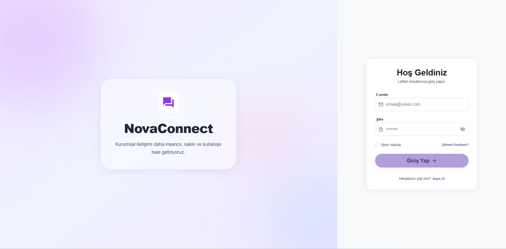 | 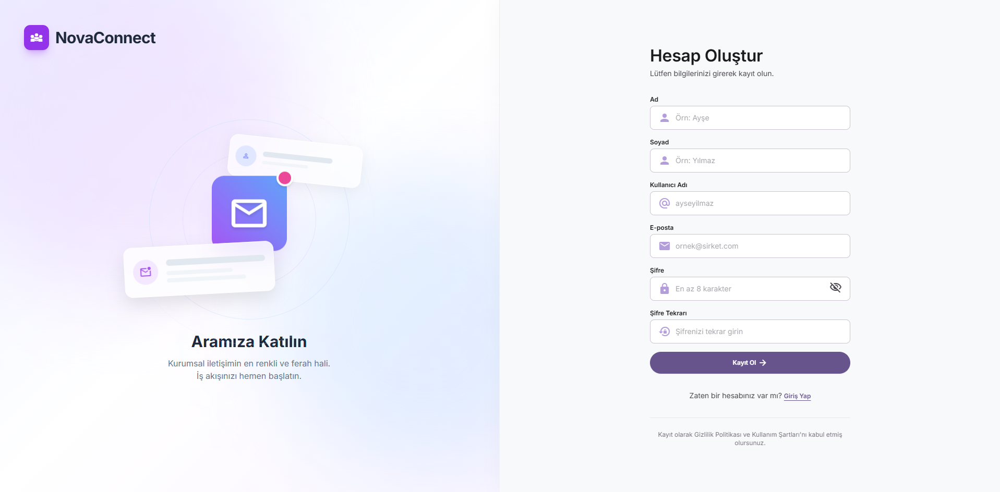 |
| 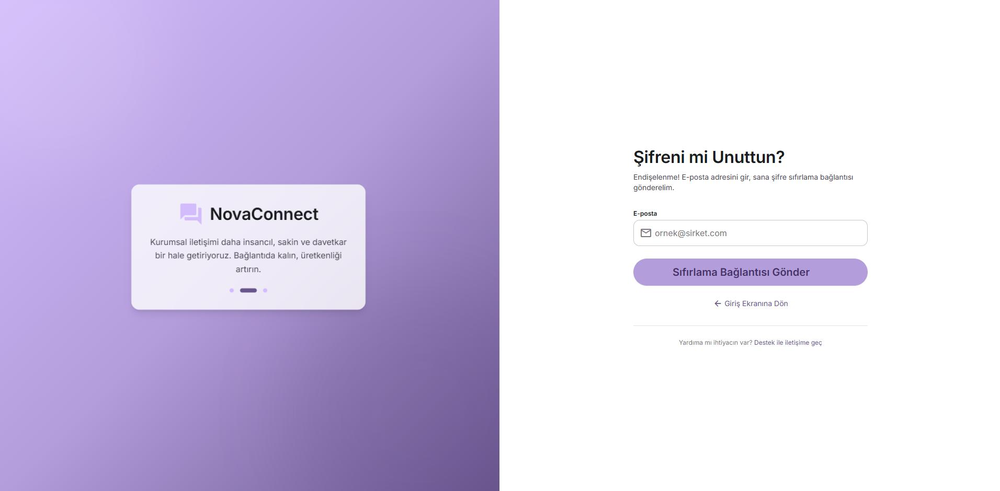 | 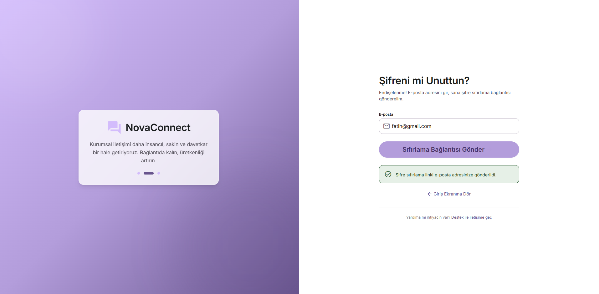 |
| 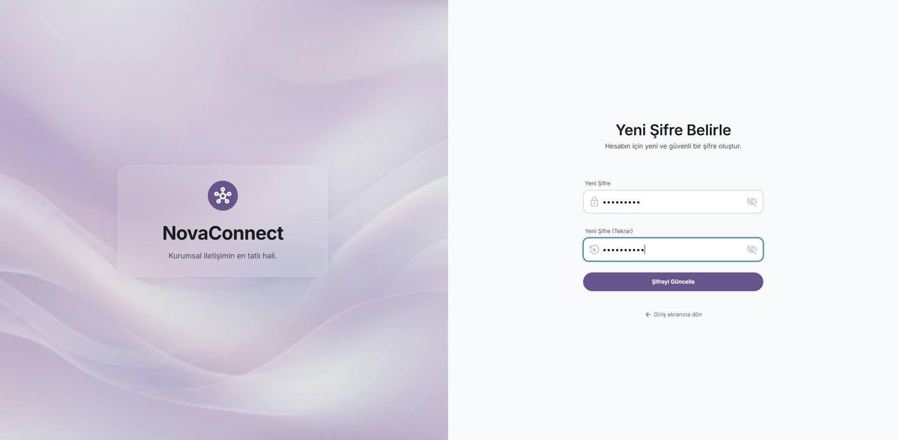 | 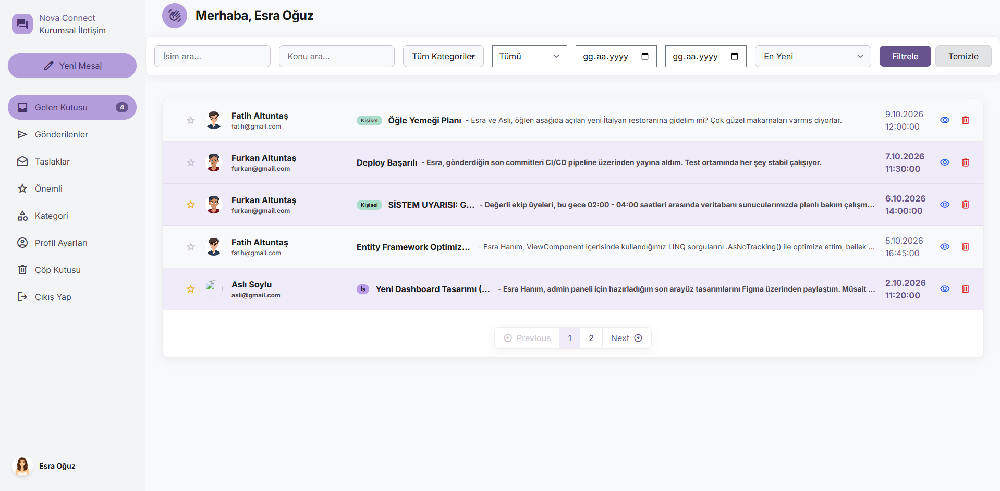 |
| 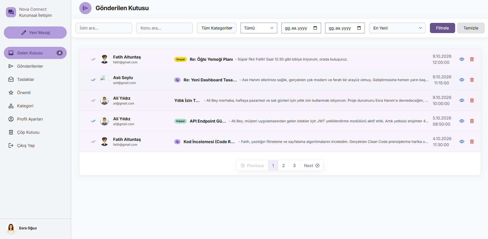 | 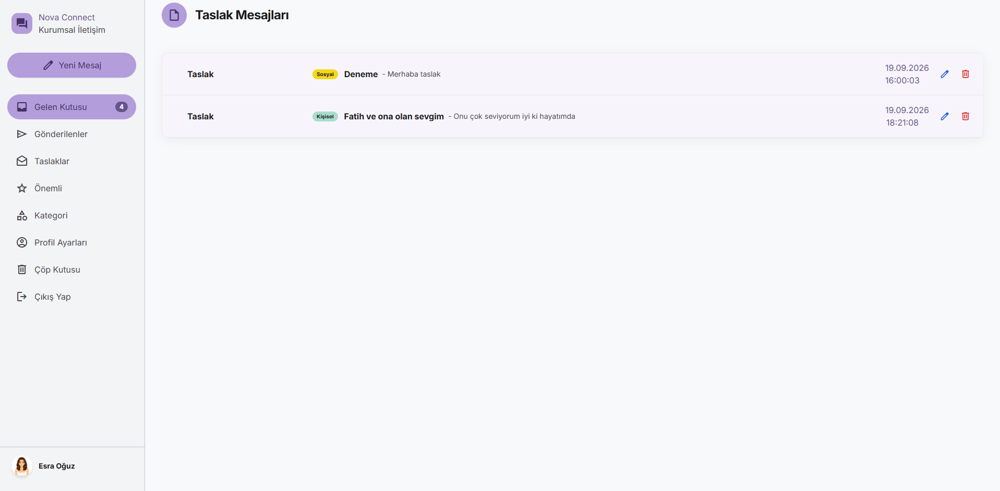 |
| 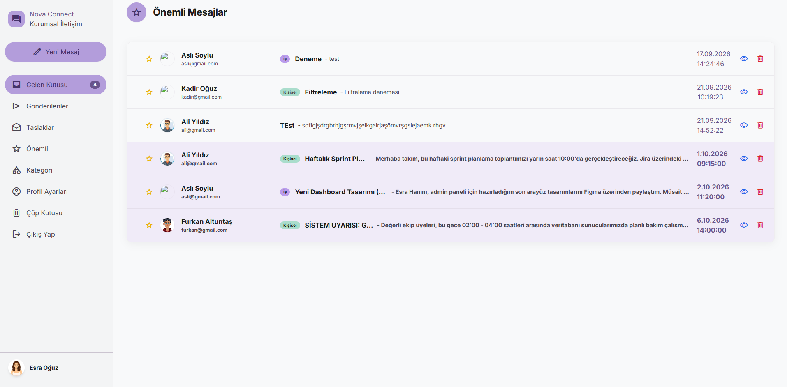 | 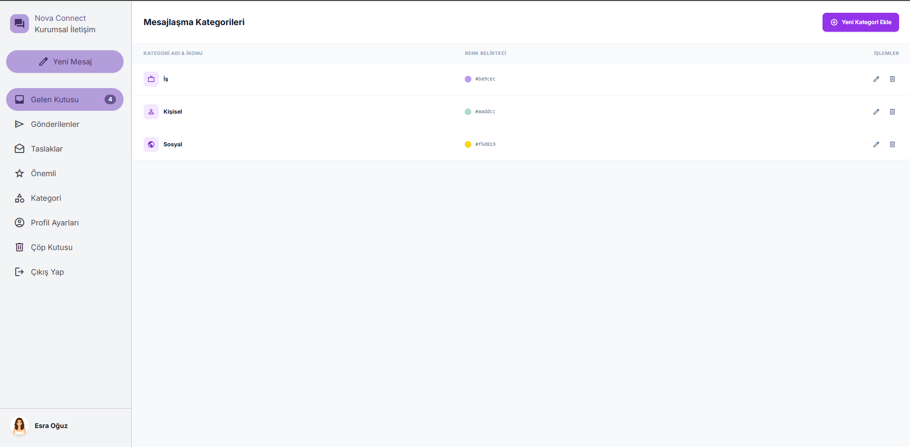 |
| 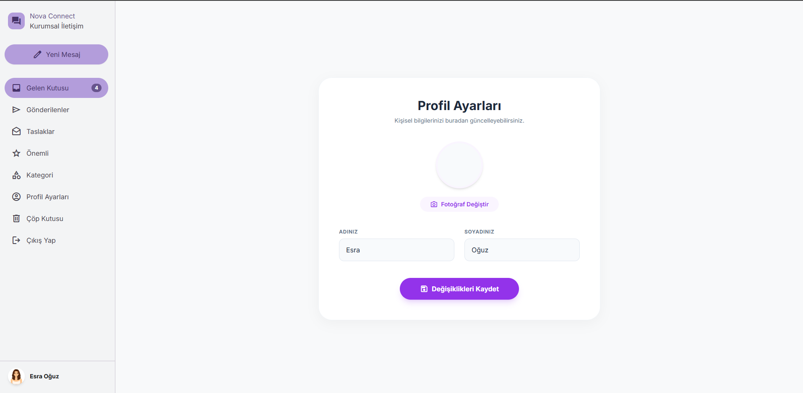 | 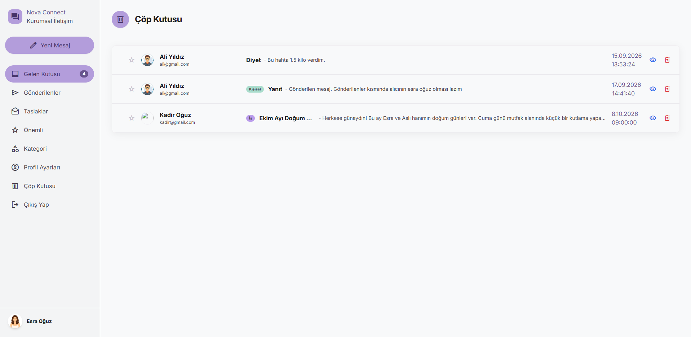 |
| 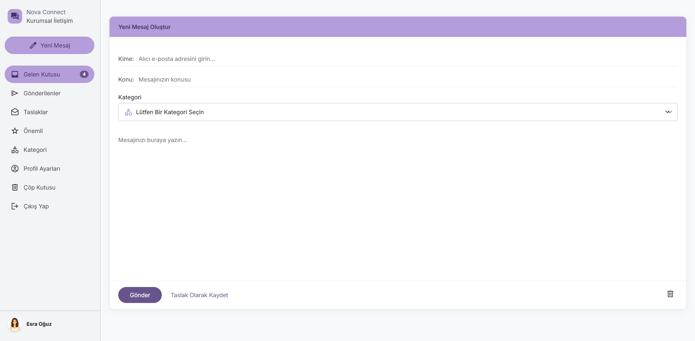 | 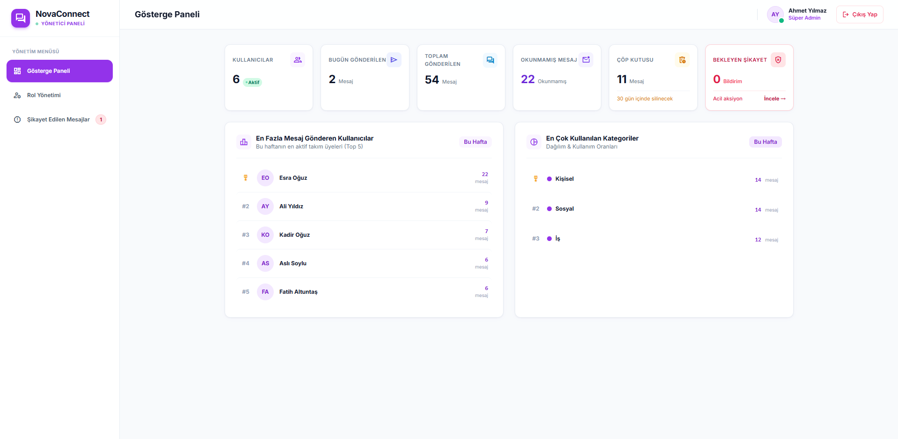 |
| 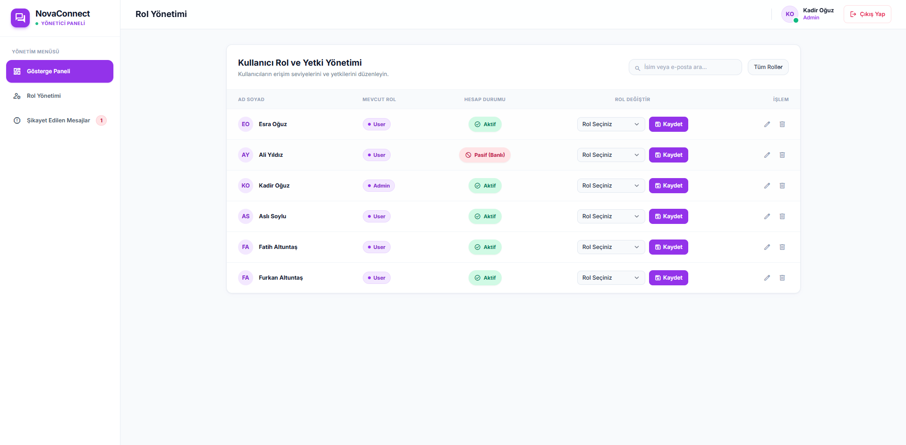 | 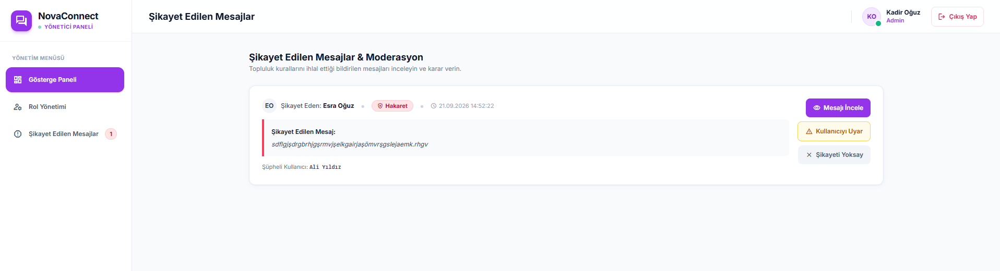 |

<br/>

## ⚙️ Kurulum ve Çalıştırma

Projeyi yerel bilgisayarınızda (local environment) çalıştırmak için aşağıdaki adımları izleyebilirsiniz:

1. **Projeyi Klonlayın**
   ```bash
   git clone https://github.com/KULLANICI_ADINIZ/MyAcademy_IdentityMailProject.git
   ```

2. **Veritabanı Bağlantısını Ayarlayın**
   `IdentityMail.Web` klasörü altındaki `appsettings.json` dosyasını açın ve `DefaultConnection` kısmını kendi SQL Server bilgilerinize göre güncelleyin.

3. **Veritabanını Oluşturun (Migration)**
   Package Manager Console (PMC) üzerinden veya terminalden şu komutu çalıştırarak veritabanını oluşturun:
   ```bash
   Update-Database
   ```

4. **Uygulamayı Başlatın**
   Visual Studio üzerinden `F5`'e basarak veya terminalden `dotnet run` komutu ile uygulamayı ayağa kaldırabilirsiniz.

